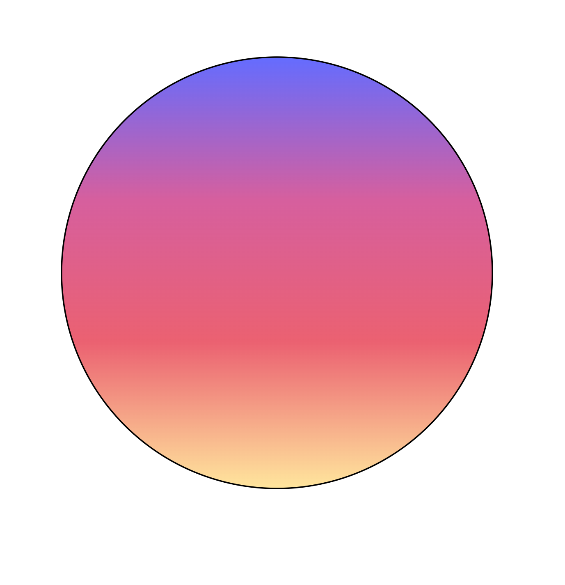

## Vježbe 2 - SVG

### Marino Linić

###### 13. listopada 2022

SVG je zapravo XML jezik koji prikazuje 2D vektorske grafike. S obzirom na to da je tekstualna datoteka, SVG datoteke zauzimaju malo mjesta i idealne su za integraciju na web, pogotovo zbog sličnosti i povezanošću s HTMLom i CSSom.

SVG je široko korišten u web UI razvoju i smatram njegovo učenje korisnim. Osim CSSa, animacije na webu većinom su rađene u SVGu.

##### Zadatak 7b ([link](https://marinolinic.github.io/racunalna-grafika/RG-Vje%C5%BEbe-2_SVG/zadatak7b.html))

