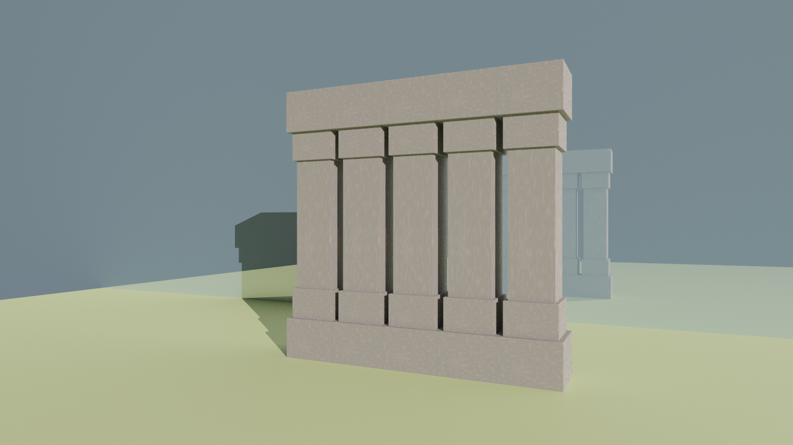

## RG - Vježbe 6: Uvod u Blender

### Marino Linić

###### 02. prosinca 2022

Blender je program s kojime možemo modelirati i izrađivati 2D i 3D grafiku. Upoznao sam se s osnovnim sučeljem i svidjelo mi se, iako neki dijelovi nisu intuitivni.

Očekujem da će postati još zanimljivije.

##### Zadatak ([Izvorne datoteke.](https://github.com/MarinoLinic/MarinoLinic-racunalna-grafika/blob/main/RG-Vje%C5%BEbe-6_Uvod_u_Blender))

