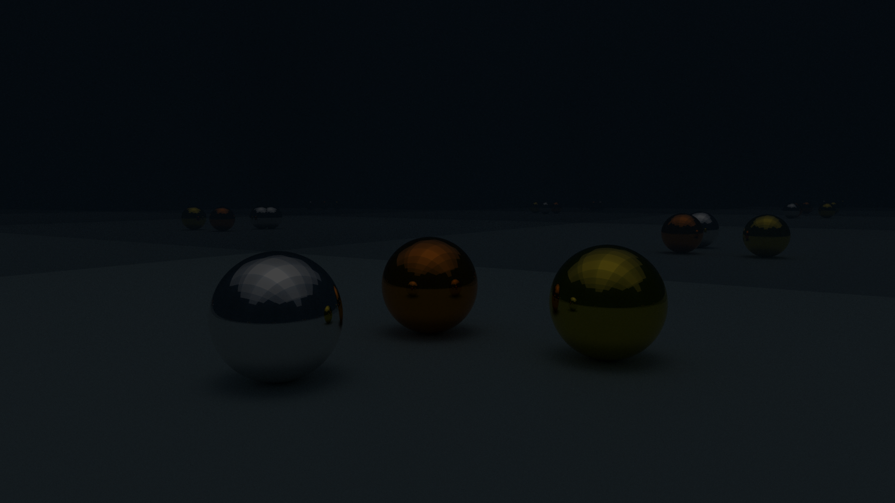
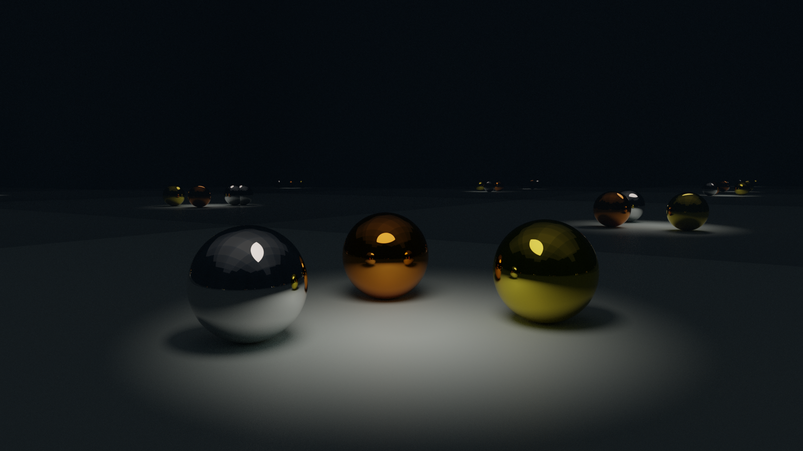

## RG - Vježbe 7: Sjenčanje u Blenderu

### Marino Linić

###### 12. prosinca 2022

Upoznao sam se s raznim novim mogućnostima u Blenderu poput sjenčanja, svjetlosti, tekstura, i slično.

Može se dodati razne atribute.

##### Zadatak ([Izvorne datoteke.](https://github.com/MarinoLinic/MarinoLinic-racunalna-grafika/blob/main/RG-Vje%C5%BEbe-7_Sjen%C5%anje_u_Blenderu))

