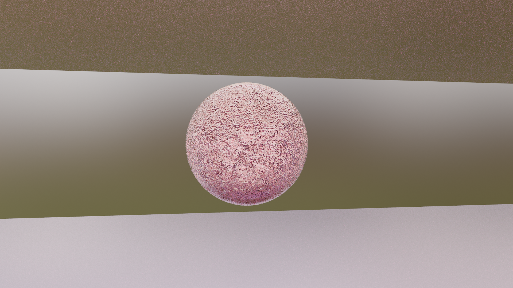

## RG - Vježbe 8: Teksture u Blenderu

### Marino Linić

###### 18. prosinca 2022

Naučio sam koristiti pravilno shadere i praviti teksture.

Vrlo poučno i zanimljivo.

##### Zadatak ([Izvorne datoteke.](https://marinolinic.github.io/MarinoLinic-racunalna-grafika/RG-Vje%C5%BEbe-8_Teksture_u_Blenderu))

